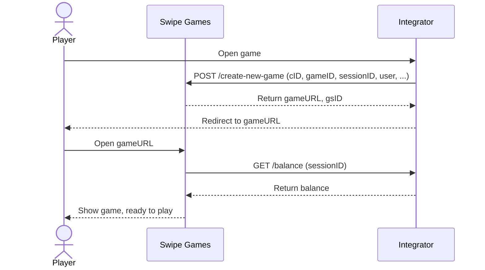
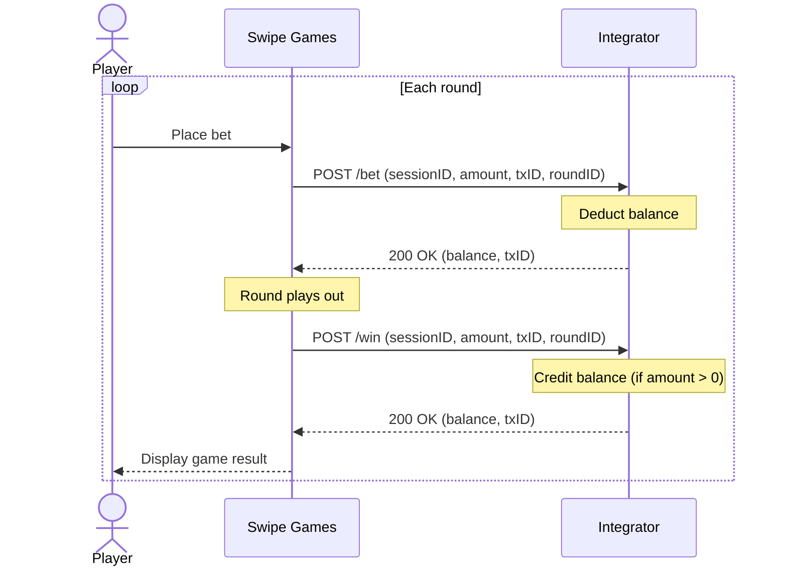
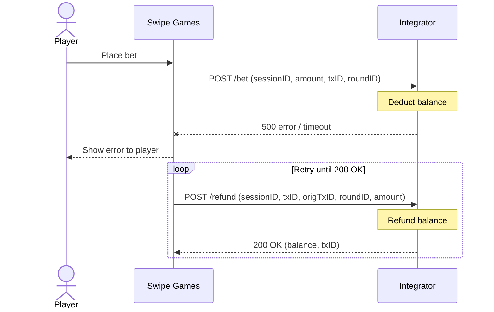

We use this integration adapter API to make reverse calls back to integrations.
It's located in our cluster and sends requests to your endpoints on every game actions (mostly related to money processing) - like bets, wins, refunds, etc.

### Setup and configuration

You need to provide us with the following information to set up the integration:

- `ExtCID` — a unique identifier for your internal client (casino, operator, etc.). You can use any string, but it should be unique across all integrations. If you have multiple clients on your side, you can provide us with a list of `ExtCID`s and we will set up all of them individually.
- Base URL of your integration API (e.g., `https://example.com/api/v1.0`) — we will set up all the endpoints for you according to the API specification. Please make sure that you provide exact endpoints for each action. You can use our OpenAPI specification to generate the server stubs for your API. If you need different base URLs for different clients, you can provide a separate base URL per `ExtCID`.
- Your `Integration API key` for authentication — we use it to sign all reverse calls to your API. You use this key to [verify request signatures](/swipegames-integration#verifying-request-signatures) on incoming requests from us.

All settings (base URL, configuration, etc.) are done per `ExtCID`. So if you have multiple clients (casinos, operators, etc.), you need to provide us with the `ExtCID` for each of them. Each `ExtCID` can have its own base URL for reverse calls.

### Verifying Request Signatures

Every request we send to your endpoints includes an `X-REQUEST-SIGN` header containing an HMAC-SHA256 signature. You must verify this signature to ensure the request is authentic and hasn't been tampered with.

The verification process differs slightly between GET and POST requests:

#### POST requests (Bet, Win, Refund)

POST request bodies are **already sent in [canonical JSON format](/authn#json-canonical-form)** (keys sorted alphabetically, no whitespace). You can use the raw request body directly to compute the signature — no additional transformation is needed.

**Verification steps:**

1. Read the raw request body (do not parse and re-serialize — use the raw bytes)
2. Compute HMAC-SHA256 of the raw body using your `Integration API key`
3. Compare the result with the `X-REQUEST-SIGN` header value

import Tabs from '@theme/Tabs';
import TabItem from '@theme/TabItem';

<Tabs groupId="language">
<TabItem value="js" label="JavaScript" default>

```javascript
const crypto = require('crypto');

function verifySignature(rawBody, signature, integrationApiKey) {
    const expected = crypto
        .createHmac('sha256', integrationApiKey)
        .update(rawBody)
        .digest('hex');
    return expected === signature;
}

// In your HTTP handler:
app.post('/bet', (req, res) => {
    const rawBody = req.rawBody; // make sure your framework preserves raw body
    const signature = req.headers['x-request-sign'];

    if (!verifySignature(rawBody, signature, integrationApiKey)) {
        return res.status(401).json({ message: 'Invalid signature' });
    }

    const request = JSON.parse(rawBody);
    // process bet...
});
```

</TabItem>
<TabItem value="python" label="Python">

```python
import hmac
import hashlib

def verify_signature(raw_body: bytes, signature: str, integration_api_key: str) -> bool:
    expected = hmac.new(
        integration_api_key.encode('utf-8'),
        raw_body,
        hashlib.sha256
    ).hexdigest()
    return hmac.compare_digest(expected, signature)

# In your HTTP handler (Flask example):
@app.route('/bet', methods=['POST'])
def bet():
    raw_body = request.get_data()
    signature = request.headers.get('X-REQUEST-SIGN')

    if not verify_signature(raw_body, signature, integration_api_key):
        return jsonify({'message': 'Invalid signature'}), 401

    data = json.loads(raw_body)
    # process bet...
```

</TabItem>
<TabItem value="go" label="Go">

```go
import (
    "crypto/hmac"
    "crypto/sha256"
    "encoding/hex"
    "io"
    "net/http"
)

func verifySignature(rawBody []byte, signature, integrationApiKey string) bool {
    mac := hmac.New(sha256.New, []byte(integrationApiKey))
    mac.Write(rawBody)
    expected := hex.EncodeToString(mac.Sum(nil))
    return hmac.Equal([]byte(expected), []byte(signature))
}

// In your HTTP handler:
func betHandler(w http.ResponseWriter, r *http.Request) {
    rawBody, _ := io.ReadAll(r.Body)
    signature := r.Header.Get("X-REQUEST-SIGN")

    if !verifySignature(rawBody, signature, integrationApiKey) {
        http.Error(w, `{"message":"Invalid signature"}`, http.StatusUnauthorized)
        return
    }

    // parse rawBody and process bet...
}
```

</TabItem>
<TabItem value="php" label="PHP">

```php
function verifySignature(string $rawBody, string $signature, string $integrationApiKey): bool {
    $expected = hash_hmac('sha256', $rawBody, $integrationApiKey);
    return hash_equals($expected, $signature);
}

// In your HTTP handler:
$rawBody = file_get_contents('php://input');
$signature = $_SERVER['HTTP_X_REQUEST_SIGN'] ?? '';

if (!verifySignature($rawBody, $signature, $integrationApiKey)) {
    http_response_code(401);
    echo json_encode(['message' => 'Invalid signature']);
    exit;
}

$request = json_decode($rawBody, true);
// process bet...
```

</TabItem>
</Tabs>

#### GET requests (Balance)

GET requests don't have a body. To verify the signature, you need to convert the query parameters into a [canonical JSON](/authn#json-canonical-form) object first.

**Verification steps:**

1. Collect all query parameters from the request URL
2. Create a JSON object from the parameters with **keys sorted alphabetically** and **no whitespace** (canonical JSON)
3. Compute HMAC-SHA256 of the canonical JSON string using your `Integration API key`
4. Compare the result with the `X-REQUEST-SIGN` header value

<Tabs groupId="language">
<TabItem value="js" label="JavaScript" default>

```javascript
const crypto = require('crypto');

function queryParamsToCanonicalJSON(queryParams) {
    // Sort keys and create compact JSON
    const sorted = Object.keys(queryParams).sort().reduce((obj, key) => {
        obj[key] = queryParams[key];
        return obj;
    }, {});
    return JSON.stringify(sorted);
}

function verifySignature(payload, signature, integrationApiKey) {
    const expected = crypto
        .createHmac('sha256', integrationApiKey)
        .update(payload)
        .digest('hex');
    return expected === signature;
}

// In your HTTP handler:
app.get('/balance', (req, res) => {
    const canonicalJSON = queryParamsToCanonicalJSON(req.query);
    const signature = req.headers['x-request-sign'];

    if (!verifySignature(canonicalJSON, signature, integrationApiKey)) {
        return res.status(401).json({ message: 'Invalid signature' });
    }

    const sessionID = req.query.sessionID;
    // return balance...
});
```

</TabItem>
<TabItem value="python" label="Python">

```python
import hmac
import hashlib
import json

def query_params_to_canonical_json(params: dict) -> str:
    return json.dumps(params, sort_keys=True, separators=(',', ':'))

def verify_signature(payload: str, signature: str, integration_api_key: str) -> bool:
    expected = hmac.new(
        integration_api_key.encode('utf-8'),
        payload.encode('utf-8'),
        hashlib.sha256
    ).hexdigest()
    return hmac.compare_digest(expected, signature)

# In your HTTP handler (Flask example):
@app.route('/balance', methods=['GET'])
def balance():
    canonical_json = query_params_to_canonical_json(dict(request.args))
    signature = request.headers.get('X-REQUEST-SIGN')

    if not verify_signature(canonical_json, signature, integration_api_key):
        return jsonify({'message': 'Invalid signature'}), 401

    session_id = request.args.get('sessionID')
    # return balance...
```

</TabItem>
<TabItem value="go" label="Go">

```go
import (
    "crypto/hmac"
    "crypto/sha256"
    "encoding/hex"
    "encoding/json"
    "net/http"
    "net/url"
)

func queryParamsToCanonicalJSON(values url.Values) (string, error) {
    flattened := make(map[string]string)
    for key, vals := range values {
        if len(vals) > 0 {
            flattened[key] = vals[0]
        }
    }
    jsonData, err := json.Marshal(flattened)
    if err != nil {
        return "", err
    }
    return string(jsonData), nil
}

func verifySignature(payload []byte, signature, integrationApiKey string) bool {
    mac := hmac.New(sha256.New, []byte(integrationApiKey))
    mac.Write(payload)
    expected := hex.EncodeToString(mac.Sum(nil))
    return hmac.Equal([]byte(expected), []byte(signature))
}

// In your HTTP handler:
func balanceHandler(w http.ResponseWriter, r *http.Request) {
    canonicalJSON, _ := queryParamsToCanonicalJSON(r.URL.Query())
    signature := r.Header.Get("X-REQUEST-SIGN")

    if !verifySignature([]byte(canonicalJSON), signature, integrationApiKey) {
        http.Error(w, `{"message":"Invalid signature"}`, http.StatusUnauthorized)
        return
    }

    sessionID := r.URL.Query().Get("sessionID")
    // return balance...
}
```

</TabItem>
<TabItem value="php" label="PHP">

```php
function queryParamsToCanonicalJSON(array $params): string {
    ksort($params); // sort keys alphabetically
    return json_encode($params, JSON_UNESCAPED_SLASHES | JSON_UNESCAPED_UNICODE);
}

function verifySignature(string $payload, string $signature, string $integrationApiKey): bool {
    $expected = hash_hmac('sha256', $payload, $integrationApiKey);
    return hash_equals($expected, $signature);
}

// In your HTTP handler:
$canonicalJSON = queryParamsToCanonicalJSON($_GET);
$signature = $_SERVER['HTTP_X_REQUEST_SIGN'] ?? '';

if (!verifySignature($canonicalJSON, $signature, $integrationApiKey)) {
    http_response_code(401);
    echo json_encode(['message' => 'Invalid signature']);
    exit;
}

$sessionID = $_GET['sessionID'];
// return balance...
```

</TabItem>
</Tabs>

> **Tip:** If you're using one of our [Integration SDKs](/sdks), signature verification is handled automatically by the `parseAndVerify*` methods — you don't need to implement it manually.

### Please whitelist our IP addresses to allow requests from our servers to your API.

#### Staging environment

- 18.185.156.20

#### Production environment

- 3.65.138.8

### Rounds, transactions and idempotency

Every game round usually consists of the sequence of actions:

- bet - player places a `bet` in the game
- win - player `wins` some money in the game (or 0 if no `win`)
- refund - usually we send a `refund` request when the `bet` request failed.

Every round has a single `RoundID` identifier, which is used to identify the round across all actions. `RoundID` could be not unique across different games, so you should use it only in the context of the game.

Every action request contains a `txID` — a globally unique transaction identifier (UUID v4) generated on Swipe Games' side. It identifies the specific action (bet, win, or refund) within the round and is directly tied to money processing. We require integrations to send back their own `txID` in the response, representing the corresponding transaction ID on the integration side, for tracking and debugging purposes.

`txID` must be used as an idempotency key on your side. If we retry a request (e.g., a `win` or `refund`), it will contain the same `txID` as the previous attempt. If you have already processed this transaction, return the same successful response with a 200 (OK) status code so we stop retrying.

**Uniqueness guarantees:**

- Swipe Games generates `txID` as UUID v4, which provides a near-zero probability of collision.
- We enforce uniqueness internally for a **rolling 3-month window** via a unique constraint.
- If you require a uniqueness guarantee beyond 3 months, use the **composite key (`txID` + `roundID`)** for all bet, win, and refund transactions on your side.

All requests from our platform must be processed in an idempotent way. This means that if we send the same request multiple times, the result should be the same as if we sent the request only once. This is crucial to avoid any issues within our integration in case of network problems or other issues.

### Retry and refund policies

#### Bet

All error codes except 200 (OK) are considered as errors. We decline game's action in case of any error and player gets notification about it.

Timeout over than 5 seconds will be considered as an error as well and refund will be issued afterwards in this case.
In case of any 500 error from your side we will issue refund as well.
All other errors aren't refundable, so if you want some transaction to be refundable, please return 500 error code.
We don't retry bet requests.

#### Win

All error codes except 200 (OK) are considered as errors. We don't decline bet action in case of win error, but we show this error to the end user.
In case of any error we will retry win request as long as you respond to our request with error.
All retrying `wins` will have the same `txID` and `roundID`, we don't use different `txID` for `win` retries.
Timeout over than 5 seconds will be considered as an error as well and win will be retried as well.
We don't send any `refunds` on win requests.

#### Refund

In case of any refund we will retry `refund` request as long as you respond to our request `error`.
All retrying refunds will have the same `txID` and `roundID`, we don't use different `txID` for retries.

**Note:** Since we are waiting for a 200 OK response from your side on refund requests, you should not return any error codes if you don't have a matching transaction on your side. For example when we break connection in case of timeout we will retry the `refund` request and you should return a 200 OK response with a valid body, even if you don't have this transaction on your side. The `balance` can be set to 0 in this scenario.

### Errors processing and client actions

In error your can return any useful information to our side, later this could be useful to track and debug some issues.
Please notice that we don't show `details` to the end user, so you can return any error you want (for debugging purposes),
but `message` could be shown to the end user, so it should be user-friendly and understandable. See more in API specification.

Also we have special `actions` which allow our client to execute some actions on client's side. See more in API specification.

### Integration flow diagrams

#### Open game flow

The following diagram shows the flow when a player opens a game. The Integrator's backend calls the Swipe Games [Core API](/core) to create a new game session, and then redirects the player to the game URL. Once the game loads, Swipe Games calls back the Integrator's [GET /balance](/swipegames-integration/get-balance) endpoint to display the player's current balance.



#### Game round (normal flow)

Each game round consists of a **bet** followed by a **win**. Swipe Games sends a [POST /bet](/swipegames-integration/bet) to the Integrator to deduct the player's balance, and after the round completes, sends a [POST /win](/swipegames-integration/win) to credit winnings (amount is 0 if no win).



#### Error handling and refund flow

When a [POST /bet](/swipegames-integration/bet) fails (500 error or timeout > 5s), the game action is declined and the player is notified. Swipe Games then issues a [POST /refund](/swipegames-integration/refund), retrying until a 200 OK is received.


